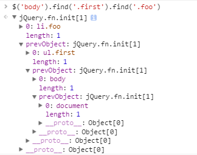

#jquery v3.1.1 源码阅读

##jQuery.extend vs jQuery.fn.extend
阅读源码可知jQuery.fn = jQuery.prototype,所以jQuery.fn.extend与jQuery.extend的区别:通过jQuery.fn.extend添加的方法属于实例方法，jQuery.extend
    
    jQuery.extend = jQuery.fn.extend = function() {
    //...
    // Handle case when target is a string or something (possible in deep copy)目标既不是对象，也不是函数，设置为空对象
    if ( typeof target !== "object" && !jQuery.isFunction( target ) ) {
        target = {};
    }
    // Extend jQuery itself if only one argument is passed 添加到jQuery对象本身，或者
    if ( i === length ) {
        target = this;
        i--;
    }
    //......
    // Return the modified object
    return target;
    };

jquery中的实例方法和对象方法大多数都是通过jQuery.fn.extend和jQuery.extend添加的。

##jQuery实例生成
jQuery实例通过jQuery.fn.init方法生成
    
    jQuery = function( selector, context ) {
        // The jQuery object is actually just the init constructor 'enhanced'
        // Need init if jQuery is called (just allow error to be thrown if not included)
        return new jQuery.fn.init( selector, context );//这里我觉得很奇怪，为什么要使用jQuery.fn.init来实例化对象，而不直接在使用new jQuery来实例化
    }, //如果使用了 new jQuery() ，我们就必须以 new $()的方式实现，这里是为了实现无new的实例化                                      
    //
1. 首先要明确，使用 $('xxx') 这种实例化方式，其内部调用的是 return new jQuery.fn.init(selector, context, rootjQuery) 这一句话，也就是构造实例是交给了 jQuery.fn.init() 方法去完成。
2. 将 jQuery.fn.init 的 prototype 属性设置为 jQuery.fn，那么使用 new jQuery.fn.init() 生成的对象的原型对象就是 jQuery.fn ，所以挂载到 jQuery.fn 上面的函数就相当于挂载到 jQuery.fn.init() 生成的 jQuery 对象上，所有使用 new jQuery.fn.init() 生成的对象也能够访问到 jQuery.fn 上的所有原型方法。
3. 也就是实例化方法存在这么一个关系链  

    * jQuery.fn.init.prototype = jQuery.fn = jQuery.prototype ;
    * new jQuery.fn.init() 相当于 new jQuery() ;
    * jQuery() 返回的是 new jQuery.fn.init()，而 var obj = new jQuery()，所以这 2 者是相当的，所以我们可以无 new 实例化 jQuery 对象

##jQuery链式法则

 jQuery的链式法则通过return this ; 将实例返回来维护，例如:

    addClass: function( value ) {      //通过return this；维护链式法则
    //...
        return this;
    },
    removeClass: function( value ) {
     //... 
        return this;
    },

##jQuery回溯

    <ul class="first">
       <li class="foo">list item 1</li>
       <li>list item 2</li>
      <li class="bar">list item 3</li>
    </ul> 
    $('.first').find('.foo').css('background-color', 'red')
    .end().find('.bar').css('background-color', 'green');
通过end,可以对代码进行回溯。

    end: function() {
        return this.prevObject || this.constructor();
    },
end很简单，返回了this.prevObject/this.constructor()
对于this.prevObject不存在时，就返回this.constructor()，constructor定义为：
    
    constructor: jQuery
因此this.constructor()，就是指$(),就是返回了一个jquery空对象。
prevObject必须看看实例函数pushStack，
通过pushStack可以将一个 DOM 元素集合加入到 jQuery 栈，上一级调用通过prevObject

    pushStack: function( elems ) {
        // Build a new jQuery matched element set
        var ret = jQuery.merge( this.constructor(), elems );
        // Add the old object onto the stack (as a reference)
        ret.prevObject = this; //设置了prevObject 
        // Return the newly-formed element set
        return ret;
    },
如图：

许多函数使用了pushStack方法：

    slice: function() {
        return this.pushStack( slice.apply( this, arguments ) );
        //这里的slice使用了数组的slice方法，通过slice将实例对象用slice分割后，传给pushStack
        //pushStack将添加了prevObject后的对象重新返回
    },
