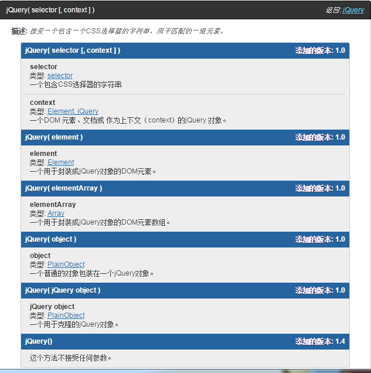

#jquery v3.1.1 源码阅读(2)

## jQuery 变量冲突处理
jQuery使用了noConflict，将$和jQuery恢复

    // Map over jQuery in case of overwrite
    var _jQuery = window.jQuery, //用于存放在JQuery初始化之前的同名函数，用于noConflict恢复
    // Map over the $ in case of overwrite
    _$ = window.$;//用于存放在$初始化之前的同名函数，用于noConflict恢复
    jQuery.noConflict = function( deep ) {
    if ( window.$ === jQuery ) {
        window.$ = _$;  //如果deep不为true,则把$恢复，而JQuery不恢复
    }
    if ( deep && window.jQuery === jQuery ) {
        window.jQuery = _jQuery;//如果deep为true,则把JQuery也恢复
    }
    return jQuery;
    };

运行了jQuery.noConflict(true)后，如果你仍想继续使用，则可以
    
    var j=jQuery.noConflict(true);
    j('body')...

##jQuery 基本架构
初看代码觉得很复杂，但仔细看看，整体的架构就是这样，细节还有很多不明白

    ( function( global, factory ) {
    "use strict";
    //....
    } else {
        factory( global );
    }
    // Pass this if window is not defined yet 如果window被定义，则为window，如果没有，则为this，即当前的执行环节
    } )( typeof window !== "undefined" ? window : this, function( window, noGlobal ) {
        //..    jQuery类方法，实例方法都在这里声明
        })

##jQuery类型判断

    jQuery.each( "Boolean Number String Function Array Date RegExp Object Error Symbol".split( " " ),
    function( i, name ) {
        class2type[ "[object " + name + "]" ] = name.toLowerCase();
        //class2type在最前面被声明{}
        //通过此函数，可以用与jQuery.type配合，区分函数类型
        //例子:class2type[ "[object  Object ]" ] = 'object' ;class2type[ "[object  Array]"] = 'array'
    } );

    type: function( obj ) {  
        if ( obj == null ) { //如果是null
            return obj + "";
        }
        // Support: Android <=2.3 only (functionish RegExp)
        return typeof obj === "object" || typeof obj === "function" ? 
            class2type[ toString.call( obj ) ] || "object" :
                         //如果是object或者function
            typeof obj; //否则 直接返回typeof obj
    },

平时为了为了判断一个对象到底是属于哪一类，会用到instanceof,Jquery的这个方法可以更方面的检测数据到底属于哪种类型。
重新改写，可以用于自己平时的代码中,如下

    function type(obj){
        var typeArray={};
        ['Boolean', 'Number', 'String', 'Function', 'Array', 'Date', 'RegExp', 'Object'].forEach(function(val,i){
             typeArray['[object '+val+']']=val.toLowerCase();
        });
        if(obj==null){
         return 'null';
        }
         return typeof obj =='object'||typeof obj =='function'?typeArray[({}).toString.call( obj )]:typeof obj;   
      }

##jQuery()
先来看看这个函数有几种用法，如图：

